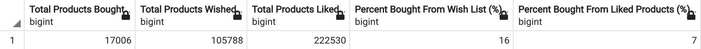

# eCommerce

## Overview

The dataset contains online transaction data from an online C2C fashion store with over 9 million registered users. C2C stands for "Customer to Customer", meaning the platform acts as a third party that facilitates transactions among customers. Only registered users are included in this dataset, and not "Visitors", who can only view the catalogs. The goal of this project was to answer to of the questions posed by the creator of the dataset on Kaggle:

"Are e-commerce users interested in social network feature?"
"How many users are likely to drop off after years of using my service?"

To answer these questions, SQL was used to organize the data and perform calculations.

## Results

The number of products wished is a better indicator of the number of products bought than the number of products liked. 

Surprisingly, those without a profile picture were more likely to have logged in recently, compared to those without a profile picture.

## Conclusion

From this data, it appears that both visitors and users have shown interested in using the social networking feature on this website. Data from other websites would need to be compared in order to generalize these results to eCommerce in general. Regardless, the social networking feature shows promise. Unfortunately, the majority of users have not used their accounts in over a year, suggesting that 
